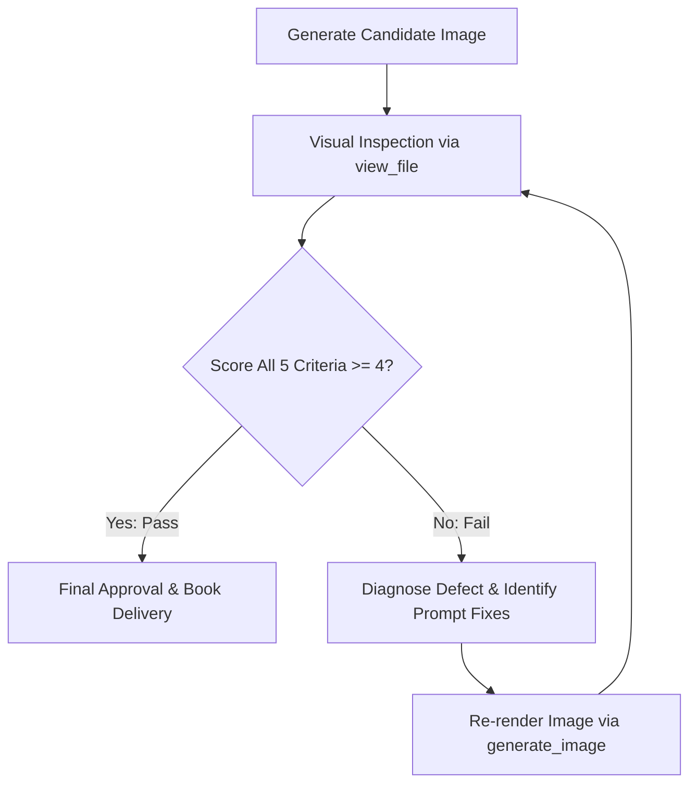

# Critique Rubric & Re-render Protocol

This document provides a systematic evaluation protocol for inspecting and refining generated cartoons. Every candidate image must be audited against the **5-Point Unsloppable Rubric** using visual inspection (`view_file`).

---

## 5-Point Evaluation Checklist

| # | Criterion | Weight | Key Visual Indicators | Threshold |
|---|---|---|---|---|
| **1** | **James Thurber Humanism** | 20% | Gentle, organic curves; soft slumping posture; vulnerable, lovable human charm; absence of sharp or aggressive caricature; flat/unshaded linework. | Min 4 / 5 |
| **2** | **R.K. Laxman Flummoxed Everyman** | 25% | Centered "Common Man"; wire-rim round spectacles; balding with wispy white side-tufts; slightly rumpled plaid/checkered coat; bewildered/perplexed posture observing absurdity. | Min 4 / 5 |
| **3** | **Saul Steinberg Line Economy** | 20% | Minimalist black pen-and-ink linework; crisp conceptual thrift; ample clean negative space; no 3D shading, airbrushing, or digital clutter. | Min 4 / 5 |
| **4** | **New Yorker-Style Caption** | 20% | Positioned neatly centered below the cartoon; legible serif lettering; deadpan, ironic single-sentence humor; correctly spelled without garbled text. | Min 4 / 5 |
| **5** | **"Unsloppable" Signature** | 15% | Legibly signed `"Unsloppable"` in bottom-right or bottom-left corner in authentic cartoonist script. | Min 4 / 5 |

**Overall Gate**: The cartoon is approved if **Total Score >= 21 / 25** and **No individual criterion scores below 4**. If any criterion fails, proceed to the Re-render Protocol.

---

## Diagnostic Rubric & Scoring

### 1. James Thurber Humanism
- **5 (Exemplary)**: Ineffable warmth and whimsical innocence. Forms are soft, slightly doughy, unstudied, and gentle. Zero pretension.
- **3 (Acceptable)**: Loose line drawing, but feels slightly generic or lacks the tender vulnerability of Thurber's figures.
- **1 (Unacceptable)**: Harsh, rigid, vector-like, hyper-stylized comic book, or photorealistic rendering.

### 2. R.K. Laxman Flummoxed Everyman
- **5 (Exemplary)**: Clearly centered everyman with signature wire spectacles, balding crown with side tufts, rumpled checkered coat, silently staring with quiet bafflement at the absurd situation.
- **3 (Acceptable)**: A confused man is present, but missing key Laxman cues (e.g. no checkered jacket, spectacles absent, or pushed to the periphery).
- **1 (Unacceptable)**: Heroic, angry, youthful hipster, or completely missing everyman figure.

### 3. Saul Steinberg Line Economy
- **5 (Exemplary)**: Pure pen-and-ink wit. Crisp black lines on clean cream paper. Ample breathing room. Every single stroke communicates an idea.
- **3 (Acceptable)**: Pen-like illustration, but has unnecessary hatching, heavy cross-shading, or cluttered background elements.
- **1 (Unacceptable)**: 3D rendered, volumetric lighting, gradients, colored fills, or digital painting effects.

### 4. New Yorker-Style Caption
- **5 (Exemplary)**: Single crisp sentence centered beneath the panel in clean serif font. Perfectly legible, deadpan irony, fits the drawing like a glove.
- **3 (Acceptable)**: Caption is funny and situated at the bottom, but has minor typography distortion or slightly too many words.
- **1 (Unacceptable)**: Missing caption, garbled AI hieroglyphics, placed inside a speech bubble, or cheesy slapstick punchline.

### 5. "Unsloppable" Signature
- **5 (Exemplary)**: Clear, legible signature `"Unsloppable"` in authentic cursive or fluid pen lettering in the corner.
- **3 (Acceptable)**: Signature is present in the corner but slightly faint or slightly stylized.
- **1 (Unacceptable)**: Missing signature, misspelled (e.g. "Unslopp", "Unslopable"), or replaced by random artist scribble.

---

## Common Failure Modes & Prompt Fixes

| Observed Defect | Root Cause | Targeted Prompt Fix / Re-render Instruction |
|---|---|---|
| **Digital shading / 3D gradients** | Model defaulted to modern digital illustration | Add strict negative prompt: `no shading, no gradients, no 3D, no digital painting, pure single-weight black dip pen line art on off-white paper, extreme line economy`. |
| **Everyman is too young or fashionable** | Archetype wasn't specified strongly enough | Emphasize: `RK Laxman Common Man archetype, balding elderly man with tufts of white hair over ears, round wire spectacles, modest rumpled checkered coat, standing flummoxed and bewildered`. |
| **Too much background clutter** | Complex scene instructions | Emphasize: `Saul Steinberg minimalist negative space, wide empty background, only 2-3 essential conceptual pen lines defining the environment`. |
| **Caption garbled or missing** | Text generation artifact | Specify exact caption in quotes with explicit layout: `featuring the exact words centered at the bottom in clean classic serif typography: "[Caption Text]"`. If the model struggles with in-image text, use image-to-image refinement or crisp caption formatting. |
| **Missing "Unsloppable" signature** | Model ignored signature directive | Explicitly include: `neatly signed "Unsloppable" in the bottom right corner in delicate black ink script`. |

---

## Re-render Protocol Workflow

1. **Inspect**: Call `view_file` on the image output path to inspect the visual details.
2. **Audit**: Complete the 5-point rubric table explicitly in your critique notes.
3. **Decide**:
   - If **Passed**: Output the final markdown report showcasing the approved cartoon.
   - If **Failed**: Document the specific failing criteria, adjust the prompt using the targeted fixes above (or pass the image as a reference in `ImagePaths` with corrective instructions), and re-render.
   - Limit to a maximum of 3 iterations to avoid infinite loops.
